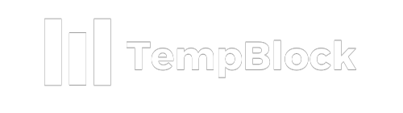

# Project BlackList Team 1



¡Olvídate de los correos temporales!
Mantén limpio y seguro tu base de datos con nuestra plataforma.
TempBlock detecta esos correos con dominio insano mediante una Black List.

## Instalación y uso de manera local

### Clona este repositorio [GitHub]

```bash
git clone https://github.com/danisan15/project_blacklist.git
```

### Instale las dependencias

Estos script instalaran las dependencias de los entornos en el frontend y el backend.

## Ejecucion local

```bash
npm run dev #
```

## Tecnologías utilizadas

- [1.Python]: es un lenguaje de alto nivel de programación interpretado cuya filosofía hace hincapié en la legibilidad de su código.
  - [1.1Flask]: es un micromarco utilizado para el desarrollo de aplicaciones web en Python.
  - [Flask-Mail]: es una extensión de Flask que permite enviar correos electrónicos desde una aplicación web Flask.
- [SheetDB]: es una plataforma en línea que permite convertir las hojas de cálculo de Google en una API JSON.
- [Node.js]: es un entorno de ejecución para JavaScript construido con V8, motor de JavaScript de Chrome.
  - [React]: es una biblioteca de JavaScript utilizada para construir interfaces de usuario interactivas en aplicaciones web.

## Estructura del proyecto 

## Derechos de autor.

Projecto realizado por: 

- Daniel @danisan15
- Christian Salazar @CsChristian20
- César @Cesar00z

### Social Oplesk Team 1 - Projecto 2
